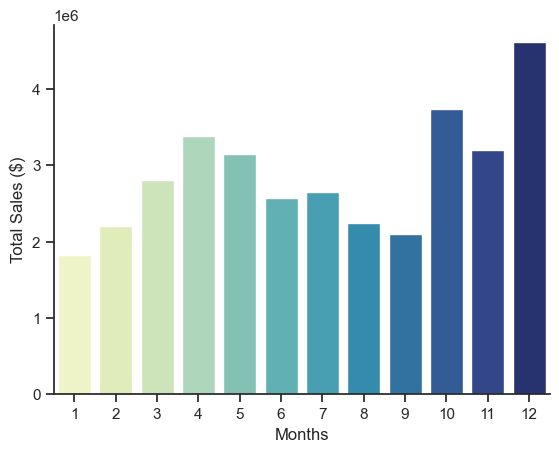
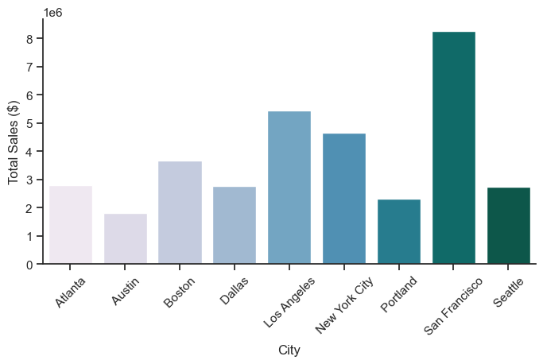

# 🛒 Sales Analysis Project — 12 Months of E-Commerce Data

Welcome to my end-to-end analysis of a full year of e-commerce sales data.  
This project explores revenue trends, city-wise performance, consumer buying behavior, product bundling, and pricing patterns.

Using Python and a complete analytics workflow, I transformed 180,000+ rows of transactional data into clear and actionable business insights.

---

# 📌 Key Business Questions

1. **What was the best month for sales? How much revenue did it generate?**  
2. **Which U.S. city had the highest sales?**  
3. **What time of day should advertisements be displayed for maximum effectiveness?**  
4. **Which products are frequently bought together?**  
5. **Which products sell the most, and how does price affect demand?**

---

# 🛠 Tools & Technologies

### **Python Libraries**
- **Pandas** — Data manipulation & cleaning  
- **Matplotlib** — Foundational plotting  
- **Seaborn** — Enhanced visualizations  
- **itertools + Counter** — Market basket analysis  

### **Environment**
- Jupyter Notebook  
- Visual Studio Code  
- Git & GitHub for version control  

---

# 🧹 Data Preparation

To make the dataset usable, several cleaning and transformation steps were performed:

- Merged all **12 monthly CSV files**  
- Removed header duplicates and corrupted rows  
- Converted `"Order Date"` into proper datetime format  
- Created new features:
  - **Month**
  - **Hour**
  - **City** (parsed from Purchase Address)
  - **Sales = Quantity × Price**
- Cleaned numeric columns  
- Identified duplicate Order IDs for bundle analysis  

---

# 📊 Analysis & Visual Results

---

## **1️⃣ Best Month for Sales**

Total monthly revenue was calculated by multiplying Quantity Ordered × Price Each and grouping by month.

### 📈 Monthly Sales  

### 🔍 Insight  
- **December** generated the highest revenue (over **$4.5M**).

---

## **2️⃣ Which City Generated the Highest Sales?**

Grouped revenue by city to determine geographic performance.

### 🏙️ Sales by City  

### 🔍 Insight  
- **San Francisco** leads with over **$8M** in annual revenue.  
- Major metropolitan areas exhibit strong purchasing power.

---

## **3️⃣ Optimal Advertisement Timing**

By analyzing the hour-of-purchase data, the strongest purchasing spikes occur at:

- **11 AM**
- **1 PM**
- **7 PM**

These windows are optimal for showing advertisements.

---

## **4️⃣ Products Most Frequently Sold Together**

Using transaction IDs and combinations:

Common pairings include:

- **iPhone + Lightning Charging Cable**  
- **Google Phone + USB-C Cable**  
- **MacBook Pro + USB-C Adapter**

These insights can be used to design effective bundle deals.

---

## **5️⃣ Which Products Sell the Most?**

### 📦 Quantity Ordered per Product  

### 🔍 Insight  
- Low-cost accessories (batteries, cables) dominate in volume.  
- Headphones and monitors are strong mid-range performers.

---

## **Price vs Quantity Analysis**

To understand how price affects demand, I overlaid product prices on the quantity chart.

### 📈 Quantity vs Price  

### 🔍 Insight  
- **Cheaper items → much higher sales volume**  
- High-priced items (MacBook Pro, ThinkPad Laptop) sell fewer units but contribute significant revenue.

---

# 📚 What I Learned

- How to clean and preprocess complex, real-world data  
- Feature engineering from raw text fields  
- Conducting time-series and geographic analyses  
- Market basket analysis using combinations  
- Dual-axis visualizations to compare quantity vs price  
- Presenting insights in a business-friendly format  

---

# ⚠️ Challenges I Encountered

- Handling inconsistencies and corrupted rows across CSVs  
- Parsing addresses reliably  
- Aligning product names across datasets  
- Managing scaling differences for overlay charts  

---

# ✅ Conclusion

This project demonstrates how data analytics can uncover:

- Seasonal peaks  
- City-level performance differences  
- Product bundling opportunities  
- Price elasticity and demand patterns  
- Optimal marketing/product strategies  

It also strengthened my Python analytics skills and provided a polished, portfolio-ready project.

---

# 📂 Project Structure

